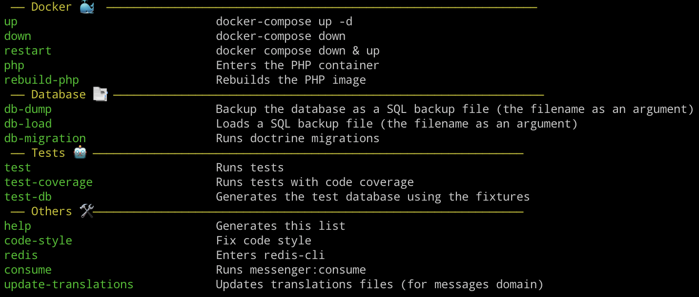

MyJProgress
==============
An application to keep track of your progress and keep you motivated even when you're feeling that you don't progress
anymore, this is the proof you are :)

Make commands
-------------
*Help*

- `make` (or `make help`) shows a list of all commands

*Docker*

- `make up` (or `make u`) to launch the containers
- `make down` (or `make d`) to stop and remove the containers
- `make restart` (or `make r`) to restart the containers
- `make php` to enter the php container
- `make rebuil-php` (or `make rp`) to rebuild the php image

*Database*

- `make db-dump mydumpfile.sql` to make a SQL backup file
- `make db-load mydumpfile.sql` to load a SQL backup file
- `make db-migration` (or `make dm`) to run the doctrine migrations

*Tests*

- `make test-db` (or `make td`) to generate the test database using the fixtures
- `make test` (or `make t`) to run tests
- `make test-coverage` (or `make tc`) to run tests with coverage

*Code style*

- `make code-style` (or `make cs`) to fix the code-style

*Rabbit MQ*

- `make consume` (or `make c` ) to run messenger:consume

*Redis*

- `make redis` to enter the redis-cli

*Translations*

- `make update-translations` (or `make ut` ) to update the translations files
